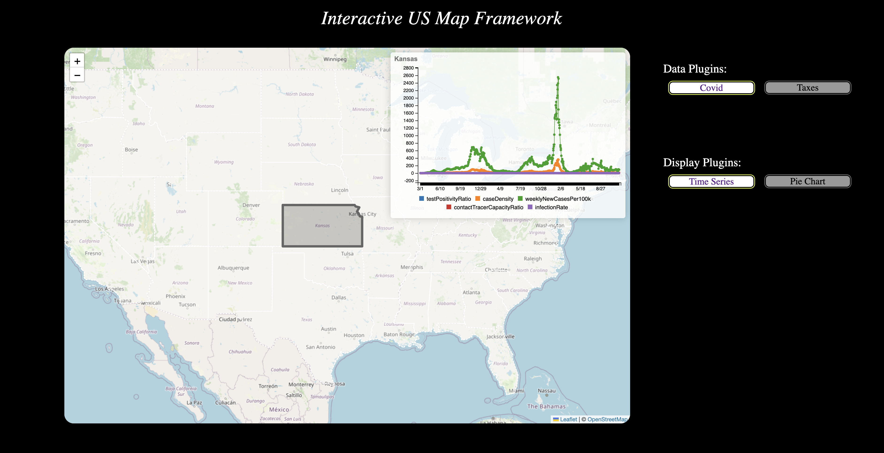

# Interactive US Map Framework
Group Name: ByteRythm  
Group Member: 
- Chenfei Lou  
email: <chenfeil@andrew.cmu.edu>  
github username: Alexanderia-Mike
- Kedi Xu  
email: <kedix@andrew.cmu.edu>  
github username: threeeyelids

## Overview

This framework provides a way to display state-wise statistics on an interactive US map. By putting the cursor on a state, the user can see the statistics displayed in the web page. The user can also select which data plugins / display plugins to apply by simply clicking the buttons on the right side of the screen. Users can customize the framework by writing their own data plugins and display plugins.




### Run the Framework

- Backend

```shell
cd ./backend
mvn exec:exec
```

- Frontend

```shell
cd ./frontend
npm install
npm start
```

**note**: 

1. If you want to run the example `CovidPlugin` or `TaxesPlugin` provided by us, please first add your own API keys to the corresponding files (go to the directory `"./backend/src/main/java/edu/cmu/cs/cs214/hw6/dataplugin"`, see TODO in`"CovidPlugin.java"`   and `"TaxesPlugin.java"` ). Register on [Covid Act Now API | Covid Act Now](https://apidocs.covidactnow.org/) to get the API key for `CovidPlugin` , and register on [BEA Data Application Programming Interface (API)](https://apps.bea.gov/api/signup/) to get the API key for  `TaxesPlugin`.
2. The example display plugin "Time Series" will work only when the data provided by data plugin have meaningful timestamps (otherwise it will show a message "the x labels of the current plugin are not convertible to time"). Thus, "Taxes" data plugin and "Time Series" display plugin do not work together with one another, because the data of Taxes is not time-series.
3. for Windows user, there may be a file error when the covid data plugin parses data. In this case, you should change the path in line 34 in CovidPlugin.java to an absolute path.

## Backend

### Register a Data Plugin

- create a new .java file under the directory `"./backend/src/main/java/edu/cmu/cs/cs214/hw6/dataplugin"`. Suppose the name of the data plugin is `"newPlugin.java"`.

- modify the file `./backend/src/main/resources/META-INF/services/edu.cmu.cs.cs214.hw6.framework.DataPlugin` by adding the following line:

  ```
  edu.cmu.cs.cs214.hw6.dataplugin.newPlugin
  ```

  replace `newPlugin` with the plugin name of your class. 

- The App.java will then automatically register the plugin to the framework when the backend server is launched.

### Implement a Data Plugin

The interface for data plugins and the definitions of data formats are located in the directory `"./backend/src/main/java/edu/cmu/cs/cs214/hw6/framework"`. Read the methods and comments in the files to familiarize yourself with the methods of the data plugins. 

#### The Data Formats

The function of data plugin is to get data from an API source, parse the data into a map 

```
Map<String, StateData>
```

recording the data for each state, and pass the map to framework.

StateData consists of `xLabels` and `DataSeries[]`, which are the values for the x axis and y axis in the display chart. There can be multiple lines of y for a group of `xLabels`, which is why there is an array for `DataSeries`. `StateData` and `DataSeries` are two record class defined as follows:

```
public record StateData(String[] xLabels, DataSeries[] data) {}
public record DataSeries(String label, double[] data) {}
```

**note**: 
1. the first element in xLabels refers to the meaning of x coordinates (e.g. `"date"`), and all elements starting from the second one are one-to-one correspondance for data in `DataSeries` (e.g. a specific date for each value). Thus, the length of `xLabels` should be 1 plus the length of `DataSeries[i]` for any `i`. E.g. you can create a `StateData` in the following way:
    ```java
    StateData dataPennsylvania = new StateData(
        new String[] {"date", "2022-11-29", "2022-11-30"},
        new DataSeries[] {
            new DataSeries("average temperature (calcius degree)", new double[] {-3, -2}),
            new DataSeries("average precipitation (ml)", new double[] {130.5, 28})
        }
    );
    ```
    You could also refer to `"./backend/src/main/java/edu/cmu/cs/cs214/hw6/resources/sample.json` for an example data structure of `StateData`.  
2. the name of state should be full name instead of abbreviations. For example, it should be Pennsylvania instead of PA. The framework will check that the state names are valid. There is also a file that maps state abbreviations to full names in `"./backend/src/main/java/edu/cmu/cs/cs214/hw6/resources/US_STATE.json"`. 

#### Implementing Plugin methods

First, read the Plugin interface.

There are two important steps to get data from an API. First, you need to connect to the source API and get the response. Second, you need to parse the response to the  `"Map<String, StateData>"` and pass it to the Framework.

To make the implementation easier, we provide **helper methods** in the class `"PluginHelper.java" `under the dataplugin directory. If you have the URI for the data source, you can use `"PluginHelper.connect(String URL_STR)" `to send an HTTP request to the data source and get the response. For time series data that is stored in a json array, you can use the method  `"PluginHelper.parseJsonArray" `.

You can also refer to our plugin implementations of `"CovidPlugin.java" `and `"TaxesPlugin.java" `, the former provides time series data parsed from a single json array, and the latter provides non-time series data by requesting multiple json objects and parsing them.

## Frontend

### Overview of `Framework.tsx`
The file `"./frontend/src/framework/Framework.tsx"` is one of the most important files in our framework. While we also have a java framework class in backend, this framework class in frontend does even more jobs in the entire program. This section is a brief introduction to help you get a better picture of this file. `Framework.tsx`'s main responsibilities include:
- keep track of all available data plugins & display plugins, as well as the current selected data plugin & display plugin
- stores all the state-wise statistical data received from backend in a class `FrameworkState`, which is imported from `"./frontend/src/components/FrameworkState.ts"`.
- render the entire GUI, including the interactive map and the clickable plugin buttons.

When the framework is launched, `index.tsx` will automatically load all registered display plugins (see [next section](#register-a-display-plugin) for how to register a display plugin) and pass these plugins to `App.tsx`, which then further pass them to `Framework`. Then Framework will then fetch all data plugins from backend, create the map and clickable buttons, and finally render the GUI page. 

Once the user click a data plugin button, this class will send a request to backend fetching data of that plugin. When the user click a display plugin button, however, this class directly sets the selected plugin in its internal state without interacting with backend. That's basically the essential logic of how our framework works.

### Register a Display Plugin
- create a new .ts file under the directory `"./frontend/src/displayplugin/"`. Suppose the file name is `"newPlugin.ts"`.
- modify the file `./frontend/src/resources/displayplugins.json` by adding `"newPlugin"` under the property `"plugins"`. Note that the added string should only include the filename WITHOUT the extension `".ts"`. E.g.
    ```json
    {
        "plugins": [
            "timeSeries",
            "pie",
            "newPlugin"
        ]
    }
    ```
- The `"newPlugin.ts"` file should export a function `function init (): DisplayPlugin` that returns a new instance of your plugin class. E.g. the file content for `"newPlugin.ts"` could be:
    ```typescript
    import { DisplayPlugin } from "../framework/DisplayPlugin";
    // import other modules here

    class newPlugin implements DisplayPlugin {
        // implement plugin methods here
    }

    function init (): DisplayPlugin {
        return new newPlugin();
    }
    export { init }
    ```

After these steps, `newPlugin` will be automatically loaded once the frontend is launched.

### Implement a Display Plugin

The interface for display plugins is located in the file `"./frontend/src/framework/DisplayPlugin.ts"`. Read the methods and comments in that file to familiarize with the methods of the display plugins. 

The most challenging function to implement might be `loadChart` function. It gets a string represents the id of html element where the chart should be loaded, as well as a `StateData` object that contains the raw data needed to be displayed in the chart. As a personal recommendation, you should first familiarize yourself with `StateData` interface (in the file `./frontend/src/components/FrameworkState`) before thinking about the function implementation. 

Two example display plugins, "timeSeries.ts" and "pie.ts" can be found in `"./frontend/src/displayplugin"` directory. Both of them use C3 library to display the chart, nevertheless you can also use other display libraries to render the chart.